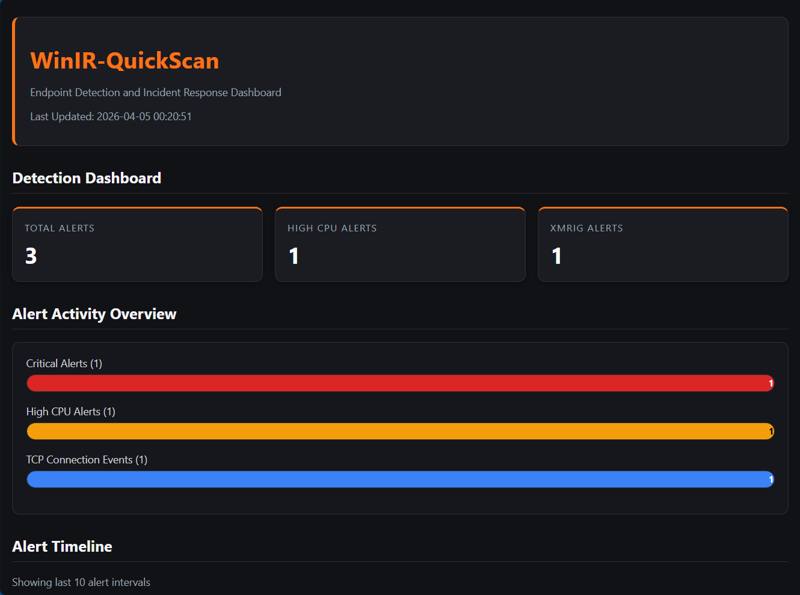
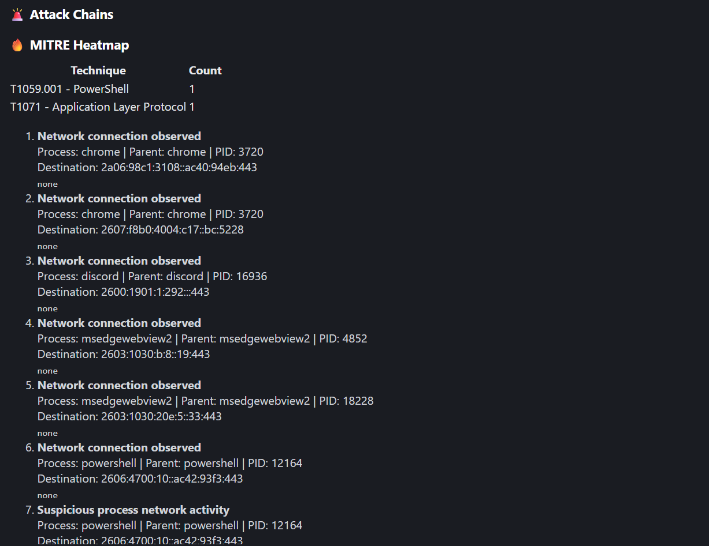
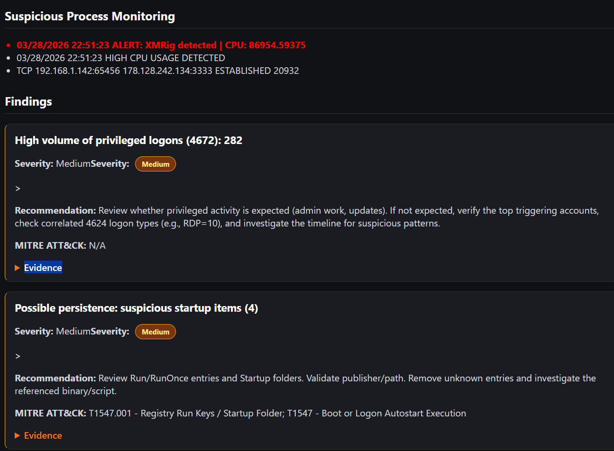
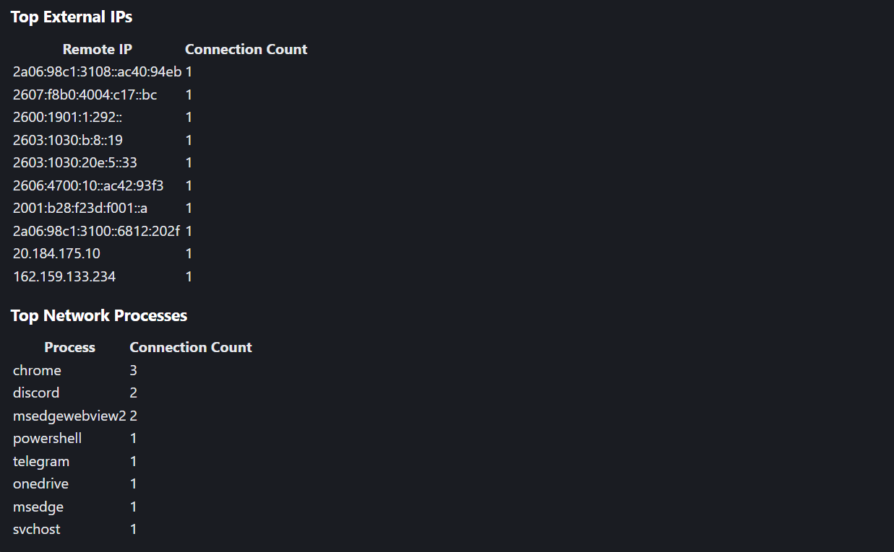
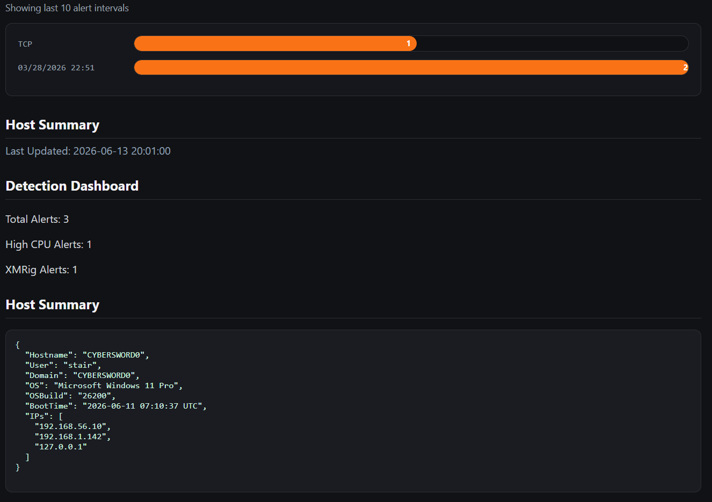

🛡️ WinIR-QuickEDR

🔥 WinIR-QuickScan — SOC + EDR Detection Platform
🛡️ Overview

WinIR-QuickScan is a Python + PowerShell–based incident response and detection platform that collects Windows telemetry, analyzes security events, and delivers real-time SOC alerts via Telegram.

This project simulates real-world cybersecurity workflows by combining incident response (IR), detection engineering, EDR telemetry, and automation.

💀 Features
🔍 Incident Response Collection
Windows Security & System event logs
Startup persistence locations
Listening ports & processes
🧠 Detection Engine
Brute force detection (Event ID 4625)
Privileged logons (4672)
Account creation & escalation (4720, 4732)
Log clearing detection (1102)
💣 Attack Chain Detection
Brute force → privileged access
Account creation → admin escalation
Defense evasion (log clearing)
💻 EDR Mode
Suspicious command-line detection
Living-off-the-land binaries (LOLBins)
Processes running from risky paths
🌐 Network Detection
SMB activity (ports 139/445)
Lateral movement indicators (RDP, RPC, WinRM)
Suspicious outbound connections
📡 Automation (Telegram Bot)
/scan → Run full IR collection
/alerts → View SOC detections
/report → Download HTML report
/godmode → Full automated pipeline
⚙️ Architecture
Windows Host (Defender)
│
├── collector.ps1 → collects logs + telemetry
├── analyze.py → processes & generates findings
├── telegram_bot.py → detection + alerts
│
└── Output:
    ├── report.json
    └── report.html
🔥 Detection Flow
Collect Logs → Analyze Data → Detect Threats → Score Risk → Send Alerts
💀 Example SOC Alert
🚨 SOC ALERT

Risk: 85/100
Level: 🔴 HIGH

💀 CRITICAL THREATS
• Attack Chain: Brute Force → Privileged Access
• Security logs cleared (Defense Evasion)

🔴 HIGH
• Suspicious PowerShell command detected
• SMB activity detected
🛠️ Setup
git clone https://github.com/JeAuto00/WinIR-QuickScan.git
cd WinIR-QuickScan
pip install -r requirements.txt

Run collector (Admin required):

.\collector.ps1 -HoursBack 48

Run analysis:

python analyze.py

Run bot:

python telegram_bot.py
🔐 Environment Variables
setx TELEGRAM_TOKEN "your_token"
setx TELEGRAM_USER_ID "your_id"
🧠 MITRE ATT&CK Coverage
T1110 – Brute Force
T1078 – Valid Accounts
T1136 – Create Account
T1098 – Account Manipulation
T1070 – Defense Evasion
T1021 – Lateral Movement
T1059 – Command Execution
T1071 – Network Communication
🏆 Project Impact

This project demonstrates:

Detection engineering
Incident response workflows
Threat hunting mindset
Automation & scripting
Security-focused development

🛡️ FINAL GOD MODE COMPLETE

Modules:
✅ Windows Event Collection
✅ SOC Detection Engine
✅ Attack Chain Correlation
✅ EDR Process Telemetry
✅ Risk Scoring
✅ HTML Report Delivery

🚨 Why This Project Matters

Modern SOC analysts are expected to quickly:

Triage authentication failures and privilege escalation

Identify persistence mechanisms

Review system and security telemetry

Produce structured, actionable findings

WinIR-QuickScan demonstrates real-world IR workflows, not offensive tooling or malware.

✨ Features

Collects Windows Security and System event logs

Detects suspicious authentication activity (Event ID 4625 bursts)

Flags privileged logons (4672)

Identifies newly created user accounts (4720)

Detects suspicious service creation (7045)

Enumerates startup persistence locations

Generates structured JSON output and HTML summary reports

Modular detection logic written in Python

🧰 Tech Stack

PowerShell – artifact collection

Python 3 – detection logic \& reporting

Windows Event Logs

HTML / JSON – analyst-friendly output

📁 Project Structure
WinIR-QuickScan/
├── collector.ps1        # Forensic artifact collection
├── analyze.py           # Detection engine \& report generator
├── detections.py        # Modular detection rules
├── output/
│   ├── security\_events.json
│   ├── system\_events.json
│   ├── startup\_items.json
│   └── report.html
<<<<<<< HEAD
├── screenshot
=======
## 📊 Dashboard Preview

  
    ## Screenshots

### Attack Chain Analysis

### Monitoring Dashboard

### Network Analysis

### Threat Hunting Dashboard

▶️ How It Works

Collector gathers relevant Windows telemetry

Data is written to structured JSON files

Analyzer applies detection logic to identify suspicious patterns

Findings are summarized in an HTML report for rapid review

🚀 Usage
1️⃣ Run the Collector (Administrator Required)
.\\collector.ps1 -HoursBack 48

2️⃣ Run the Analyzer
python analyze.py

3️⃣ Review Results

Open output/report.html in your browser.

🧠 Learning Objectives

This project demonstrates:

Windows security event interpretation

Incident response data collection

Detection logic design

Defensive automation

Analyst-oriented reporting

⚠️ Disclaimer

This tool is intended for defensive and educational purposes only.
Run only on systems you own or are authorized to analyze.

🗺️ Roadmap

Sigma-style rule support

MITRE ATT\&CK mapping

CSV export for SIEM ingestion

Timeline-based analysis mode

Hash validation of persistence files

👤 Author

Joseph E. Autorino
GitHub: https://github.com/JeAuto00

